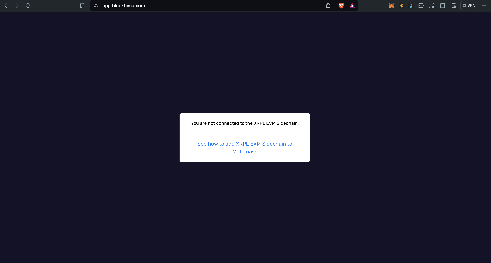
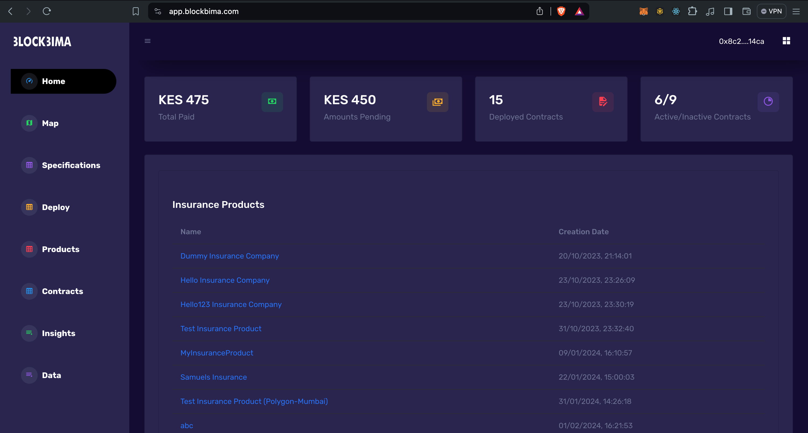
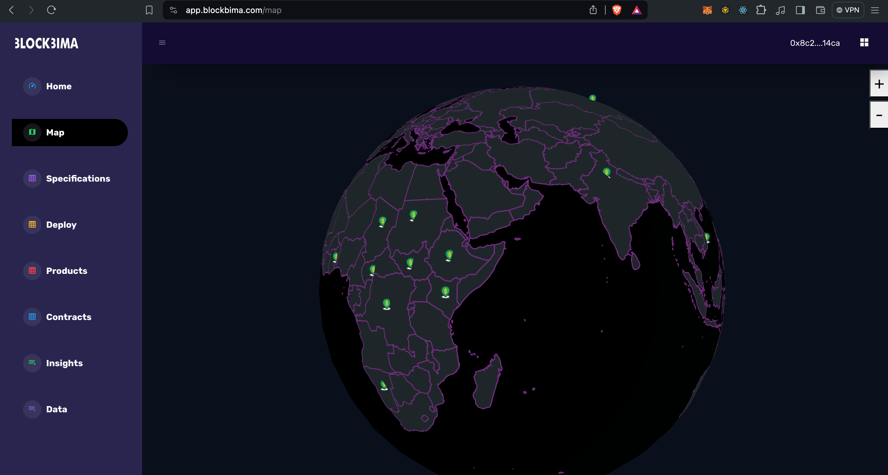
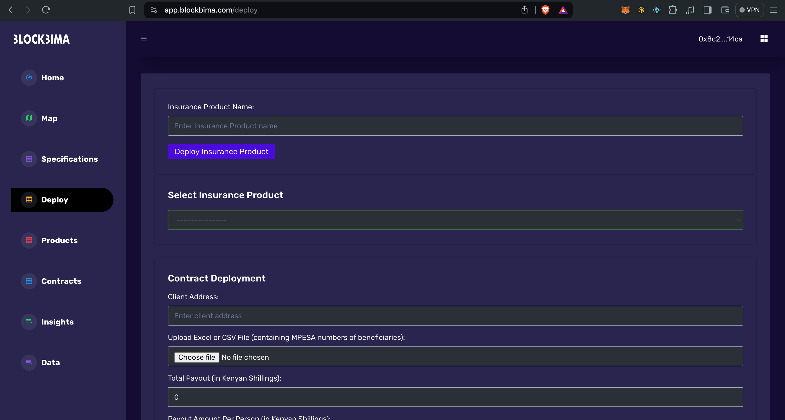
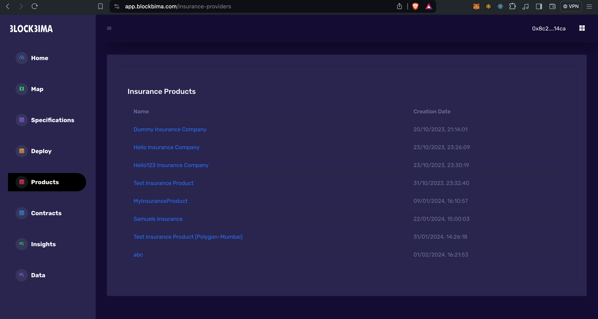
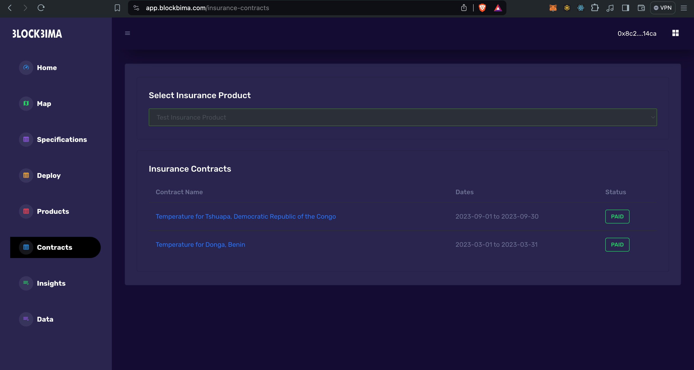

# Hardhat Setup for Blockbima Smart Contracts

### Overview

This protocol consists of mainly 2 smart contracts:

1. **`BlockbimaInsuranceProvider`**: Which represents a **BlockBima Insurance Product** that acts as a **factory** for deployment/creation of **BlockBima Insurance Contracts** with different specifications.

2. **`BlockbimaInsuranceConsumer`**: Which represents a **BlockBima Insurance Contract** deployed under a particular **`BlockbimaInsuranceProvider`** with a particular specification, generally in terms of thematic area representing the type of the insurance, start and end dates representing the duration of the insurance and area of interest representing the concerned geographical location.

---

### Utilising XRPL EVM Sidechain

1. In ShambaGeoConsumer contract available in [Shamba Smart Contract Kit](https://github.com/shambadynamic/shamba-smartcontractkit) inherited by the **`BlockbimaInsuranceConsumer`** contract, we've deployed the [Chainlink Operator Contract](https://docs.chain.link/chainlink-nodes/contracts/operator) to **XRPL EVM Sidechain**, and added the details of the same in our job spec of the corresponding [Chainlink XRPL Node](https://docs.chain.link/chainlink-nodes/v1/running-a-chainlink-node) that we're running in our backend.

Here's the code snippet containing the deployed operator contract address on **XRPL EVM Sidechain** (having ETH-ChainId as `1440002`):

```js
else if (chainId == 1440002) {
    operatorAddress = 0xf8A6b3b38895C861C37F93EF8058F54B7c16fe75;
}
```

[Permalink to the line of code](https://github.com/shambadynamic/shamba-smartcontractkit/blob/5995d76348c1c5cb306ee855115e73b4e4d4db70/contracts/utils/libraries/NetworkConfig.sol#L20)

2. Also, in the `etherscan` object of the `hardhat.config.js` file, the **XRPL EVM Sidechain** is added in the `customChains` array:

```js
customChains: [
    {
        network: "rippleEvmSidechain",
        chainId: 1440002,
        urls: {
            apiURL: "https://evm-sidechain.xrpl.org/api",
            browserURL: "https://evm-sidechain.xrpl.org",
        }
    }
]
```

This enables us to deploy and verify the contracts fluently on the **XRPL EVM Sidechain** network by passing the `rippleEvmSidechain` in the `network` flag while executing the deploy task:

```
npx hardhat deploy BlockbimaInsuranceProvider 1440002 --network rippleEvmSidechain

npx hardhat verify ${BlockbimaInsuranceProvider_Address}  1440002 --network rippleEvmSidechain
```

---

### Application

The application is available as [Blockbima](https://app.blockbima.com/) for **[XRPL EVM SIdechain](https://opensource.ripple.com/docs/evm-sidechain/intro-to-evm-sidechain/)**.

---

### UI Screenshots

1. If user's wallet is not connected to the **XRPL EVM Sidechain** network:



2. Home page showcasing various data insights as well as a list of **BlockBima Insurance Products** deployed by the connected user's wallet: 



3. Globe showcasing the deployed **BlockBima Insurance Contracts** at various places:



4. Deployment form for **BlockBima Insurance Product** and **BlockBima Insurance Contract**:



5. List of available **BlockBima Insurance Products** deployed by the connected user's wallet: 



6. List of the **BlockBima Insurance Contracts** deployed under a particular **BlockBima Insurance Product** deployed by the connected user's wallet: 



---

### Demo Video

To get a brief demo of the working, you can watch the walkthrough video showcasing the interaction with the application:

[](https://youtu.be/0IjRl9w67KI)

---

### Deployment using Remix

You can open and interact with this protocol in **Remix IDE**:

<a href="https://remix.ethereum.org/#version=soljson-v0.8.24+commit.e11b9ed9.js&optimize=true&runs=200&gist=c46861c005c66c3443a6352e53492b48&lang=en&evmVersion=null" target="_blank">
  
</a>
